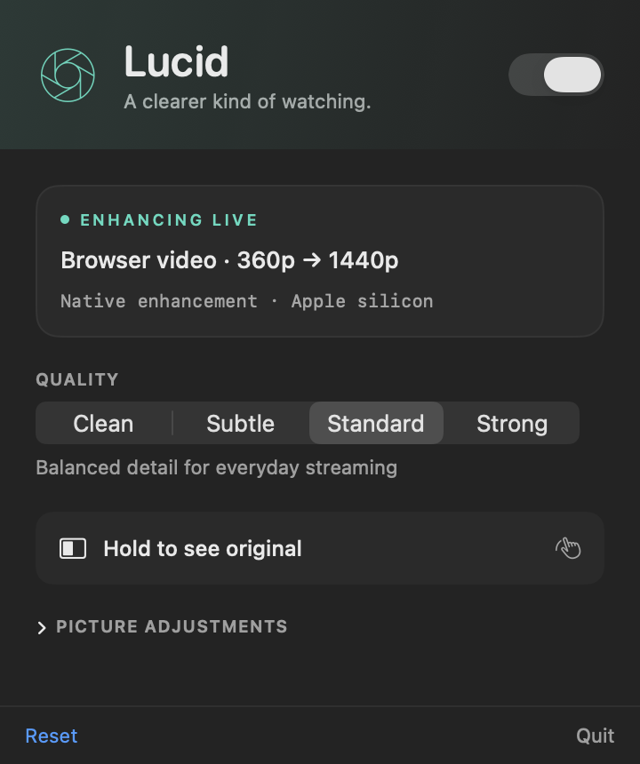

# Lucid

Native video super resolution for Apple silicon. Lucid takes decoded browser
frames, reconstructs them with Core ML, restores detail with Metal, and returns
the result to the video player. Processing stays on your Mac.



## What ships

- **2× learned reconstruction, one model.** `lucidbig2k_`: an unshuffled SPAN
  trunk with a direct 2× head, fine-tuned on full-frame codec-context streams
  from 21 sources with a reference target and an input-conditioned paired DINO
  critic. Seven fixed input shapes cover 144p through 720p. There is no model
  choice anywhere in the product; promotion is a deliberate edit of
  `Lucid/Resources/Models.json` backed by a native delivery holdout.
- **Grain-aware post-stages.** Debanding runs only on true quantisation
  plateaus (any neighbour more than about 1.3 levels away marks grain or
  texture and is left alone), followed by contrast-adaptive sharpening that
  cannot leave the range of the pixels it was computed from, and a tone grade.
- **Motion-aligned temporal filtering.** A bounded Metal block matcher reprojects
  previous-frame luma. Photometric confidence rejects unreliable matches;
  neighborhood clipping limits trails. Seeks, repeated timestamps, long gaps,
  and incompatible frame geometry reset history.
- **An explicit color contract.** Browser color metadata travels with the frame.
  BGRA, RGBA, I420, and NV12 are validated and normalized to video-range Rec.709
  NV12 before enhancement. PQ and HLG inputs are declined.
- **Bounded streaming.** The browser captures only for the admitted session,
  with expiring status leases and two capture credits. A single pending native
  frame bounds conversion work. Output favors fresh frames over a backlog.
- **Modern browser transport.** Chrome 148+ uses typed-array structured cloning;
  older Chrome versions use the JSON-compatible path. The authenticated drawing
  iframe receives NV12 directly over loopback WebSocket. Structured cloning
  still copies data; this is not a zero-copy browser pipeline.
- **Native controls.** Clean, Subtle, Standard, and Strong picture presets,
  adjustments, companion setup, and hold-to-compare. Turning Lucid off stops
  frame capture and clears the enhanced surface.
- **Presentation feedback.** Sequence numbers correlate input with browser draw
  acknowledgments. The panel reports presented frames/s and capture-to-canvas
  p95, separately from native processing time. This measures draw submission,
  not physical screen scanout.

Decoded playback drawn in the browser needs **no Screen Recording permission**
and no native window match. Screen-capture fallback is a separate path.

## Supported video

Lucid targets unprotected SDR video from 144p through 720p that is being
enlarged by at least 1.15×. It keeps an existing session down to 1.0× to avoid
toggling at the boundary. A source must fit a bundled model shape; 1080p and
above are declined.

HDR enhancement, protected playback, and universal website compatibility are
not supported promises. Lucid is an independent application; it does not
contain NVIDIA RTX software or integrate with the browser compositor at driver
level.

## Evidence, September 8, 2026

Native delivery holdout (960 frame pairs, eight sources, the Release app's own
pipeline end to end, scored with LPIPS and DISTS against the SPAN ch32utc 4×
model that shipped before): **+12.26% LPIPS / +16.10% DISTS, all eight sources
up**, at about 40% lower graph cost. The full ladder of what was tried, what was
measured natively and what was rejected is in
`Benchmarks/frontier/paired-ladder-protocol.md`; the promotion gate is
`Tools/frontier_eval/gate_perceptual.py` (`paired-critic-protocol.md` and
`perceptual-gate-protocol.md` explain why it is perceptual rather than
fidelity-based). Apple's MetalFX temporal scaler fed with video was measured on
the same holdout and lands at Lanczos level; the receipt is in the protocol.

### Earlier evidence, September 4, 2026 (4× SPAN era)

The [current development evidence](Benchmarks/frontier/README.md) records
source-disjoint sequence screening, rejected candidates, temporal fixes, trained
Core ML conversion checks and the experimental causal 2× architecture. No new
model has passed promotion, and native 720p/1080p support remains experimental.

The initial [benchmark artifacts](Benchmarks/2026-09-04/) include corpus hashes,
per-frame metrics, CUDA training logs, native ablations, and browser checks.
That checkpoint evaluation contains 120 paired images from one crowd scene
across six resolutions; it is not broad source-disjoint evidence.
These image metrics evaluate reconstruction; they do not establish temporal
quality or superiority to RTX VSR.

| Checkpoint | LPIPS ↓ | DISTS ↓ | PSNR Y ↑ | Decision |
|---|---:|---:|---:|---|
| Lanczos anchor | 0.6129 | 0.2243 | 25.17 | Reference |
| Shipping ch32utc | 0.5336 | 0.1986 | 25.48 | Retained |
| ch48utc | 0.5341 | 0.1975 | 25.49 | Added cost without a clear overall gain |
| ch48utc GAN | 0.5358 | 0.1982 | 25.09 | Not promoted |
| ch32 motion-supervised candidate | 0.5552 | 0.1971 | 25.55 | Not promoted |
| Matched ch32 control | 0.5549 | 0.1962 | 25.55 | Not promoted |

The RTX 4080's existing GAN run was allowed to finish. Two additional matched
2,000-step experiments ran on that GPU: motion-aligned consistency versus static
consistency, with the same initial weights, data, seed, FFT objective, and learning
rate. They completed in approximately 1.0 and 0.8 minutes. Their improvement in
pixel fidelity did not justify the perceptual regression. Shipping weights were
preserved.

The initial native motion filter is a separate change. In a 12-frame ablation on each
of two matched clips, it lowered LPIPS from 0.5532 to 0.5385 on Crowdrun and
0.2524 to 0.2509 on Dinner. Fine-detail energy increased. Static-pixel flicker
also increased from 2.044 to 2.488 and 0.382 to 0.406 respectively. It trades
some smoothing for retained detail; it is not a universal temporal-quality win.
The subsequent stationary-history fix reduces flicker on those clips, but the
crowd still flickers more than motion-off; see the current evidence above.

The final optimized native pipeline was also timed for 60 frames after eight
warmup frames, with the browser test stopped:

| Input | Native mean | Native p95 |
|---|---:|---:|
| 424×240 | 9.57 ms | 12.62 ms |
| 640×360 | 12.59 ms | 14.14 ms |
| 854×480 | 17.90 ms | 18.36 ms |

These timings include preprocessing, Core ML color conversions and prediction,
and detail processing. They exclude decoding, transport, and presentation.

An isolated Chrome 152 test verified real WebCodecs input, MessageChannel
structured cloning through the actual companion worker, Core ML inference,
visible iframe output, original comparison, and no frame capture while Off.
The worker/iframe snapshot recorded about 36 presented frames/s and 39 ms p95
with 640×360 input and 2560×1440 internal reconstruction on an M4 Pro.
Internal reconstruction dimensions do not prove delivered transport resolution;
the later copy/presentation fixture delivers a 1280×720 display surface.
The harness emulates the runtime ports;
it does not certify extension installation, third-party CSP behavior, or Safari
playback. The Safari companion was separately build-verified.

## Build and browser companion

Requires Apple silicon, macOS 26+, and Xcode with the macOS 26 SDK.

```sh
xcodebuild -project Lucid.xcodeproj -scheme Lucid -configuration Release \
  -derivedDataPath .build/release build CODE_SIGNING_ALLOWED=NO
```

Every Xcode build verifies the source model hashes in
`Lucid/Resources/Models.json` and compiles the required models into the app.
Changed models invalidate their compilation receipt. Missing or corrupt source
models fail the build. The six image models and six tensor-output alternatives
are tracked in git. On the measured M4 Pro/macOS 26.5.1 backend, Lucid checks
the bundled alternatives against the image model before using their faster
output conversion. Other backends and failed checks use the image model;
a prediction failure also restores it. Reconstruction weights are unchanged.

Open the app at `.build/release/Build/Products/Release/Lucid.app`.
For Chrome or Edge, open `chrome://extensions` or `edge://extensions`, enable
Developer mode, choose **Load unpacked**, and select `BrowserExtension`.
Reload your video tab. The companion is not published in a browser store.

For Safari, build the project under `SafariCompanion/Lucid Companion`, open
Lucid Companion, and enable its extension in Safari Settings. Its resources
are generated from the canonical browser implementation:

```sh
python3 Tools/sync_safari.py
python3 Tools/sync_safari.py --check
```

`Tools/release.sh <version>` builds a signed disk image containing the app and
Chrome/Edge companion. It uses configured signing identities and notarization
credentials when available. A local development build is not a notarized public
release.

## Verification

```sh
node --test Tools/stream-policy.test.js
python3 -m unittest discover -s Tools -p 'test_*.py'
zsh Tools/check-ladder.sh
xcodebuild -project Lucid.xcodeproj -scheme Lucid -configuration Debug \
  -derivedDataPath .build/tests test -only-testing:LucidTests CODE_SIGNING_ALLOWED=NO
```

The native suite exercises actual Metal kernels, moving grain, motion and scene
cuts, color conversion, malformed frame layouts, model predictions, settings
parity, and presentation metrics. GPU tests require a physical Apple silicon
Mac; hosted CI excludes that suite explicitly.

`Tools/browser_fixture.py` creates the local worker/iframe fixture. Launch a
separate test app with `LUCID_BRIDGE_PORT=47911 LUCID_TOKEN_PORT=47912
LUCID_EPHEMERAL=1` and serve the fixture over loopback HTTP. Ephemeral mode keeps
the test token and enable switch out of the normal app's persisted state.

## Training and evaluation

The minimal SPAN architecture and Apache-2.0 license are included under
`Tools/architectures`; training no longer depends on an ignored upstream checkout.
Training requires PyTorch, NumPy, Pillow, and a codec-degradation patch bank.
The CUDA experiments used the available PyTorch 2.6.0+cu124 environment; Mac
conversion/evaluation used PyTorch 2.14.0 and coremltools 9.0.

```sh
python Tools/train_span.py --init baseline.pth --bank-dir path/to/bank \
  --channels 32 --input-frames 1 --motion-temporal --temporal 0.15 \
  --fft 0.05 --steps 2000 --batch 16 --lr 0.00002 --seed 20260904 --device cuda
python Tools/convert_trained.py --weights checkpoint.pth --sizes 640x360
python Tools/eval_checkpoint.py checkpoint.pth --corpus path/to/paired/corpus \
  --report evaluation.json
```

Checkpoints preserve optimizer, scheduler, RNG states, arguments, and framework
version. This supports resuming the same environment; it does not guarantee
bitwise reproducibility across different GPU kernels or PyTorch versions.
Patch-bank validation is an internal training diagnostic, not an independent
benchmark. Checkpoints and training corpora are separate artifacts.

The latest [matched subspace experiment](Benchmarks/frontier/subspace-adapter-protocol.md)
completed both RTX 4080 training arms. It improved perceptual scores but failed
reference-detail limits on both validation sets; shipping weights remain unchanged.

Tuning tools require an explicitly matched reference or a registered clean pair;
they cannot silently score an arbitrary clip against the compressed BBB video.
The experiment called `version=2` is a learned-sigmoid SPAN adaptation, **not**
the published SPANV2 architecture.

## Research basis

The implementation favors measurable real-time reconstruction over an untested
claim of generative detail. The September 2026 review considered
[NTIRE 2026 efficient super resolution](https://arxiv.org/html/2604.03198v1),
[streaming-specific training and evaluation](https://arxiv.org/html/2602.11339v1),
[StreamDiffVSR's August 2026 revision](https://arxiv.org/abs/2512.23709v3), and
[Apple's WWDC26 Metal developments](https://developer.apple.com/videos/play/wwdc2026/359/).
The shipping network remains Core ML SPAN; it is not diffusion or Metal 4 inline
ML. Browser transport follows
[Chrome's structured-clone messaging support](https://developer.chrome.com/blog/structured-clone-messaging).
